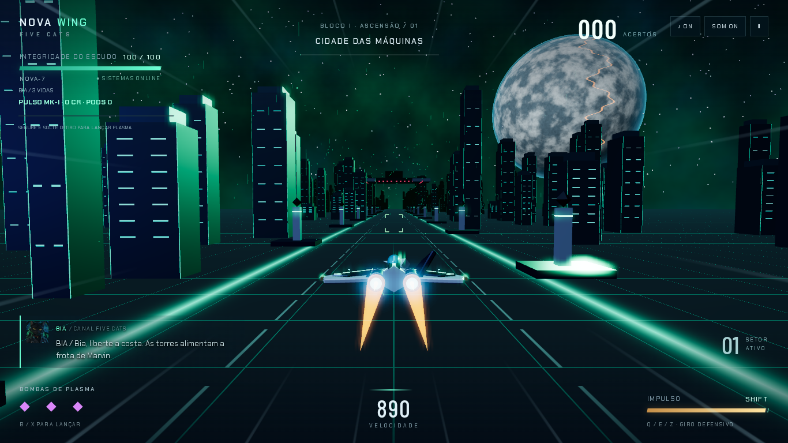
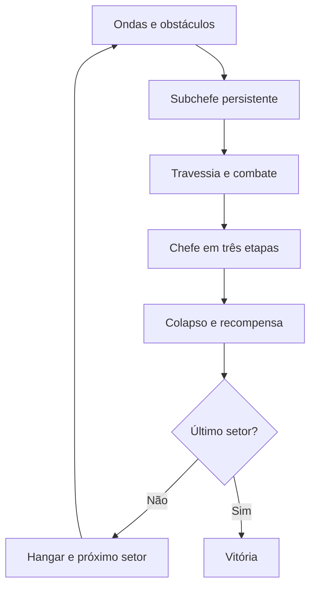
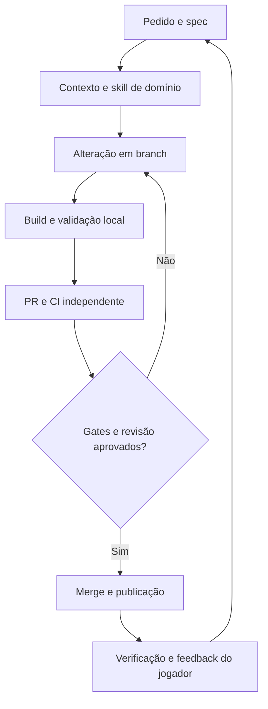

# 🚀 Nova Wing 3D — Five Cats

**Uma nave. Dez setores. A última chance da Terra.**

Pilote a NOVA-7 com o esquadrão Five Cats em uma campanha de combate aéreo: cidades neon, instalações industriais, asteroides e fortalezas orbitais até o confronto com Marvin. Abra no navegador, escolha iniciar e jogue com teclado ou toque.

**[▶ Jogar agora](https://trucco86.github.io/nova-wing-3d/)** · [Como desenvolver](#desenvolvimento) · [Mapa do repositório](docs/REPOSITORIO.md) · [Harness](docs/HARNESS.md) · [Histórico](CHANGELOG.md)



_Captura real do jogo em teste de navegador. Os diagramas abaixo explicam a arquitetura; não são imagens de gameplay._

## 🎮 O jogo

Bia, Bob e Christopher enfrentam a frota de máquinas de Marvin. Cada piloto representa uma das três vidas da campanha. A nave avança automaticamente; você controla a posição, desvia dos obstáculos, administra o impulso e escolhe quando carregar plasma, lançar pods ou gastar uma bomba.

- **Dez setores**, cada um com ambiente, chefe e subchefe próprios.
- **Chefes biomecânicos** com dois geradores destrutíveis, núcleo protegido e três etapas de combate.
- **Combate terrestre** com tanques, sentinelas gigantes e passagens de túnel nos ambientes compatíveis.
- **Seis níveis de armamento**, plasma carregado e pods com três evoluções.
- **Hangar entre setores**, créditos, compras e checkpoint local.
- **Trilha sintetizada** que acompanha fase, subchefe, chefe, fúria, colapso e vitória.

É uma edição WebGL inspirada na temática do [Nova Wing original](https://github.com/trucco86/nova-wing), construída com assistência do Codex. Esta versão usa Three.js; o original usa projeção própria em Canvas 2D. Os motores e as regras não são idênticos.

## Controles

| Ação                     | Computador                            | Celular               |
| ------------------------ | ------------------------------------- | --------------------- |
| Pilotar                  | WASD ou setas                         | Joystick esquerdo     |
| Atirar / carregar plasma | Segurar Espaço; soltar libera a carga | Segurar e soltar TIRO |
| Impulso                  | Shift                                 | BOOST                 |
| Giro defensivo           | Q, E ou Z                             | GIRO                  |
| Bomba                    | B ou X                                | BOMBA                 |
| Lançar / recolher pods   | V                                     | LANÇAR / VOLTAR       |
| Pausar / retomar         | P ou Esc; botão de pausa              | Botão de pausa        |
| Música / efeitos         | Botões ♪ e SOM                        | Botões ♪ e SOM        |

No celular, prefira a horizontal. O navegador precisa de WebGL e aceleração gráfica. Não é necessário instalar Node, Java ou aplicativo para jogar. A tela inicial oferece ajuda recolhida em **Como jogar**. Áudio é desbloqueado ao iniciar a missão.

## Mecânicas

### Escudo, vidas e impulso

Você começa com três vidas, 100 de escudo e três bombas. Ao perder uma nave, o próximo piloto assume na mesma posição, com proteção temporária. O giro também protege por um intervalo curto. O boost consome energia e acelera o cenário; soltar permite recuperar energia. A chama alaranjada e os rastros indicam que o impulso está ativo.

### Anéis e armamento

| Item                | Efeito                                                                    |
| ------------------- | ------------------------------------------------------------------------- |
| **Verde, com cruz** | Recupera até 25 de escudo, limitado pela blindagem atual                  |
| **Azul, com setas** | Evolui a arma; a cada três coletados, aumenta o conjunto de pods até três |

Anéis surgem dentro do alcance horizontal da nave, inclusive após redimensionar a tela. A aproximação possui atração de curta distância; a coleta considera o cruzamento em profundidade, inclusive no boost.

| Nível | Arma           | Disparos por rajada | Cor principal |
| ----- | -------------- | ------------------: | ------------- |
| I     | Pulso MK-I     |                   2 | Verde-água    |
| II    | Gêmeo MK-II    |                   2 | Ciano         |
| III   | Tríade MK-III  |                   3 | Azul          |
| IV    | Plasma Vórtice |                   4 | Violeta       |
| V     | Plasma Nova    |                   6 | Roxo          |
| VI    | Aniquilador Ω  |                   8 | Magenta       |

A potência também aumenta o dano. Segurar o tiro mantém as rajadas e acumula plasma; soltá-lo após carga suficiente lança um projétil mais forte.

### Pods: lançamento e retorno

Inspirados no conceito de módulos destacáveis dos shoot 'em ups, os pods possuem núcleo, carcaça e animação próprios. Cada evolução muda a forma e a cadência.

| Estado     | Comportamento                                                          |
| ---------- | ---------------------------------------------------------------------- |
| Acoplado   | Acompanha a nave e dispara com o jogador                               |
| Lançando   | Avança continuamente até a posição de combate                          |
| Destacado  | Mantém posição lateral independente e dispara automaticamente em leque |
| Retornando | Recolhe até a nave sem teletransporte                                  |

No nível III, os disparos usam perseguição de alvos, incluindo o ponto elevado de tanques e robôs. Os pods interceptam projéteis comuns que atravessam seu volume; isso não torna a nave imune nem protege contra colisões com cenário. Evoluir com a formação lançada preserva a posição dos pods existentes.

### Chefes, subchefes e destruição

O subchefe permanece na arena até ser derrotado. O túnel aguarda sua eliminação, e o chefe final do setor aguarda a saída do túnel. Cada encontro tem assinatura de ataque própria.

Nos chefes, elimine os geradores e aproveite as janelas de exposição do núcleo. A batalha passa por três etapas e acelera conforme a vida diminui. Um orçamento de dano por tempo evita eliminar um chefe instantaneamente com armas máximas. A derrota termina numa sequência de oito segundos com explosões, destroços e onda de choque; a recompensa é concedida uma vez ao final.

### Campanha

| Setor | Região                | Subchefe           | Chefe            |
| ----- | --------------------- | ------------------ | ---------------- |
| 01    | Cidade das Máquinas   | Cruzador ROK       | Caça-líder ROK   |
| 02    | Distrito Portuário    | Arraia Abissal     | Nave-Ferrão      |
| 03    | Cinturão de Destroços | Broca Sentinela    | Perfurador       |
| 04    | Estação Órbita-9      | Satélite Cruzado   | Fortaleza Órbita |
| 05    | Tempestade de Dados   | Ave Solar          | Fênix de Plasma  |
| 06    | Setor Congelado       | Caranguejo Glacial | Colosso Glacial  |
| 07    | Núcleo Púrpura        | Medusa Viva        | Colmeia Viva     |
| 08    | Grade de Batalha      | Fortim Ômega       | Couraçado Ômega  |
| 09    | Abismo de Órion       | Prisma do Vazio    | Núcleo Bastião   |
| 10    | Trono de Marvin       | Guardião da Coroa  | Imperador Marvin |



O hangar vende canhões, blindagem, pods, reparos e bombas. O checkpoint guarda setor, créditos e melhorias no armazenamento deste navegador. Continuar recupera a campanha com três vidas e suprimentos básicos; não sincroniza entre aparelhos.

## Tecnologia

| Camada       | Implementação                                             |
| ------------ | --------------------------------------------------------- |
| Linguagem    | JavaScript em módulos ES                                  |
| Renderização | Three.js 0.170.0 / WebGL, cenário procedural e bloom      |
| Interface    | HTML e CSS responsivos                                    |
| Áudio        | Web Audio; osciladores, sequenciador, filtro e compressor |
| Persistência | localStorage com validação e fallback                     |
| Build        | esbuild incorpora código, CSS e retrato em um HTML        |
| Testes       | Node test runner + Playwright/Chromium                    |
| Entrega      | GitHub Actions → GitHub Pages                             |

Geometrias compartilhadas, instâncias e limites de entidades reduzem trabalho de renderização. O pixel ratio é limitado por categoria de dispositivo. Não existe aqui o ajuste automático por FPS descrito no projeto original, nem promessa de desempenho uniforme em todo aparelho.

## Desenvolvimento

Use **Node.js 24**. Python 3 é opcional para os atalhos legados em `tools/`.

```sh
npm ci
npm run build
npm run dev
```

Abra `http://127.0.0.1:4173`. O servidor entrega o HTML gerado: depois de editar `src/`, execute o build e recarregue. Para os testes de navegador:

```sh
npx playwright install --with-deps chromium
npm run format
npm run build
npm run validate -- --browser
```

> **Fonte → build → entrega.** Edite `src/`, nunca `index.html`. O build é unidirecional; não há comando de extração que sobrescreva a fonte a partir do HTML.

## 📁 Organização do repositório

A separação segue a proposta do Nova Wing original: fonte, ferramentas, testes, skills e documentação. Nesta edição, os subsistemas são módulos próprios.

| Caminho                                                            | Responsabilidade                                        |
| ------------------------------------------------------------------ | ------------------------------------------------------- |
| [src/main.js](src/main.js)                                         | Entrada da aplicação                                    |
| [src/game.js](src/game.js)                                         | Orquestração de estado, combate e interface             |
| [src/input.js](src/input.js)                                       | Teclas do jogo e proteção contra gestos do navegador    |
| [src/campaign.js](src/campaign.js)                                 | Setores, armas, loja e checkpoint                       |
| [src/flight.js](src/flight.js)                                     | Câmera de perseguição e colisão varrida                 |
| [src/encounters.js](src/encounters.js)                             | Tanques, robôs, obstáculos e túnel                      |
| [src/bosses.js](src/bosses.js)                                     | Modelos e assinaturas de ataque de chefes/subchefes     |
| [src/combat.js](src/combat.js)                                     | Vida, fases, blindagem e orçamento de dano do chefe     |
| [src/equipment.js](src/equipment.js)                               | Modelos compartilhados de anéis e pods                  |
| [src/finale.js](src/finale.js)                                     | Colapso, choque e destroços                             |
| [src/visuals.js](src/visuals.js)                                   | Nave, mundo, materiais e pós-processamento              |
| [src/audio.js](src/audio.js)                                       | Sequenciador e estados musicais                         |
| [src/shell.html](src/shell.html), [src/styles.css](src/styles.css) | Capa, HUD, menus e toque                                |
| `src/assets/`                                                      | Recursos incorporados no build                          |
| `index.html`                                                       | Artefato gerado e versionado para distribuição          |
| `tools/`                                                           | Build, leitura de contexto, criação de spec e validação |
| `tests/`                                                           | Harness de simulação, testes de domínio e fixtures      |
| `tests/browser/`                                                   | Fluxos reais de navegador e capturas WebGL              |
| [specs/](specs/README.md)                                          | Contratos e critérios de aceite por alteração           |
| [skills/](skills/README.md)                                        | Procedimentos reutilizáveis por domínio                 |
| `.agents/skills/`                                                  | Links para descoberta das mesmas skills                 |
| [docs/](docs/REPOSITORIO.md)                                       | Arquitetura, operação, testes e aprendizado             |
| `.github/`                                                         | CI, revisão, templates e responsáveis                   |

Veja [onde editar e como os módulos se relacionam](docs/REPOSITORIO.md). O `game.js` ainda concentra a orquestração; extrair um subsistema exige preservar testes e interfaces, não apenas mover arquivos.

## 🧠 Harness: desenvolvimento verificável com agentes

O harness deste projeto reúne **contexto versionado, procedimentos, ferramentas, testes e controles de entrega**. Ele apoia o agente que você estiver usando; não é um serviço residente chamando modelos.



| Camada                           | Orienta ou executa?      | Papel                                                           |
| -------------------------------- | ------------------------ | --------------------------------------------------------------- |
| [AGENTS.md](AGENTS.md)           | Orientação               | Mapa, comandos e limites de trabalho                            |
| Specs                            | Contrato versionado      | Define resultado e evidência esperada                           |
| Skills                           | Orientação especializada | Procedimento para física, dinâmica, gráficos, áudio e entrega   |
| `tools/context.mjs`              | Ferramenta               | Localiza módulos e trechos sem carregar o bundle                |
| `tools/validate.mjs`             | Verificação executável   | Executa gates, interrompe na falha e registra evidências        |
| Testes e invariantes             | Verificação executável   | Exercitam o código real e contratos de estrutura                |
| CI + proteção de branch          | Controle externo         | Validação do commit e requisitos para integração                |
| Revisão visual e aparelho físico | Avaliação                | Legibilidade, ergonomia e comportamento que mocks não comprovam |

### Fluxo recomendado

```sh
npm run agent:context -- --mapa
npm run agent:context -- input
npm run agent:new -- minha-alteracao
# Leia AGENTS.md, a spec e a skill pertinente; implemente em branch.
npm run format
npm run build
npm run validate
npm run validate -- --browser
```

A validação padrão executa formatação, ESLint, testes de domínio, invariantes e sincronização da entrega. `--browser` acrescenta WebGL, teclado/toque, capturas e síntese real de áudio. `artifacts/validation.json` registra commit, digest da fonte, comandos, duração, resultado e erros; logs e imagens ficam nos artefatos da CI.

**Não publique com gate vermelho.** Corrija a causa, execute novamente no commit final e confira o resultado do Pages. Passar nos testes não prova que a estética ficou boa ou que todos os gestos nativos do iPhone foram cobertos.

Detalhes: [harness e responsabilidades](docs/HARNESS.md) · [matriz de specs](specs/README.md) · [testes e limites](docs/TESTES.md).

## Comandos úteis

| Comando                                | Resultado                                         |
| -------------------------------------- | ------------------------------------------------- |
| `npm run dev`                          | Servidor local na porta 4173                      |
| `npm run build`                        | Gera `index.html`                                 |
| `npm run build:check`                  | Confirma correspondência exata entre fonte e HTML |
| `npm run format`                       | Formata código e documentação                     |
| `npm run lint`                         | Analisa JavaScript                                |
| `npm test`                             | Testes determinísticos sem GPU                    |
| `npm run test:browser`                 | Suíte Playwright; requer Chromium                 |
| `npm run check:repo`                   | Estrutura, links, IDs, skills e workflow          |
| `npm run validate`                     | Gates locais com relatório                        |
| `npm run validate -- --browser`        | Gates locais e navegador                          |
| `npm run agent:context -- --mapa`      | Mapa para leitura dirigida                        |
| `npm run agent:new -- nome-da-mudanca` | Nova spec sem sobrescrever arquivo existente      |

## Versionamento

O jogo usa **SemVer** (`MAJOR.MINOR.PATCH`) e mostra a versão na capa. Cada release tem notas em `releases/`, tag `vX.Y.Z` e commit correspondente. O gate exige incremento para alterações distribuídas. A GitHub Release é criada automaticamente após sucesso do Pages. Veja [política e passo a passo](docs/VERSIONAMENTO.md).

## Publicação e recuperação

O Pages usa **GitHub Actions**. A sequência é `quality` → `browser` → `pages`; PRs validam, mas apenas a branch principal publica. São enviados HTML e licenças, sem fixtures ou ferramentas de teste. As regras de branch são configuração remota: o arquivo YAML não as ativa sozinho.

Para desfazer uma entrega, reverta o commit, gere novamente o HTML e passe pelos mesmos gates. Instruções em [PUBLICACAO.md](docs/PUBLICACAO.md).

## Documentação e créditos

- [Arquitetura e estados](docs/ARQUITETURA.md)
- [Mapa do repositório e onde editar](docs/REPOSITORIO.md)
- [Harness, gates e evidências](docs/HARNESS.md)
- [Testes e limitações](docs/TESTES.md)
- [Aprendizados](docs/APRENDIZADOS.md)
- [Histórico de versões](CHANGELOG.md)
- [Licenças e referência original](THIRD_PARTY_NOTICES.md)

MIT, conforme [LICENSE](LICENSE). Nomes e bases musicais foram adaptados do Nova Wing de Cristian Trucco; Three.js mantém sua licença. O retrato de Bia foi gerado para este protótipo. Google Fonts é opcional, com fallback local. Star Fox e R-Type servem como referências de gênero e mecânica; este projeto não é um produto oficial dessas franquias.

### Modelos para desenvolvimento

O harness inclui seleção determinística por tarefa, risco e capacidade, com fallback entre modelos configurados. Veja [política e exemplos](docs/MODELOS.md). Execute `npm run agent:route -- implementation medium 12000`; sem configuração, a seleção permanece bloqueada.
