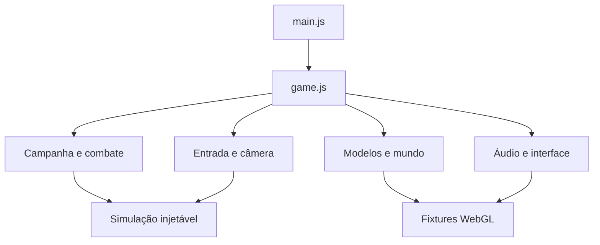

# Mapa do repositório

Este mapa complementa o [README](../README.md) e a [arquitetura](ARQUITETURA.md). A separação segue o Nova Wing original, adaptada a módulos ES e WebGL.

## Fronteiras

| Camada                | Entrada                      | Saída / consumidor                                                 |
| --------------------- | ---------------------------- | ------------------------------------------------------------------ |
| Produto               | `src/` e assets              | Jogo no navegador                                                  |
| Build                 | `tools/build.mjs`            | `index.html` com código incorporado                                |
| Simulação             | `tests/harness.mjs`          | Instância real de `createGame`, com relógio e ambiente controlados |
| Renderização de teste | Fixtures em `tests/`         | Páginas locais de teste, PNGs e WAV                                |
| Entrega               | Workflow em `.github/`       | Artefatos da CI e arquivos públicos do Pages                       |
| Contexto do agente    | AGENTS, specs, skills e docs | Instruções e critérios para a alteração                            |



`game.js` coordena os módulos. Os modelos visuais não decidem créditos, vitória ou checkpoint. `combat.js` centraliza a resistência do chefe; `campaign.js` valida persistência. `input.js` reúne teclas e proteção de gestos, mas o despacho de ações permanece na instância do jogo.

## Onde fazer uma mudança

| Pedido                                   | Comece por                                      | Validação prioritária                        |
| ---------------------------------------- | ----------------------------------------------- | -------------------------------------------- |
| Tecla, pressão longa ou seleção de texto | `src/input.js`, handlers em `src/game.js`, CSS  | `tests/input-title.test.mjs`, navegador      |
| Capa, HUD e responsividade               | `src/shell.html`, `src/styles.css`              | Capturas desktop, paisagem e retrato         |
| Movimento, boost, colisão                | `src/flight.js`, atualização em `src/game.js`   | Variação de delta, limites, pausa, boost     |
| Inimigo terrestre ou túnel               | `src/encounters.js`                             | Passagens, colisão varrida, alvo elevado     |
| Chefe ou subchefe                        | `src/bosses.js`, `src/combat.js`                | Dano, geradores, progressão e captura        |
| Anéis e pods                             | `src/equipment.js`, integração em `src/game.js` | Coleta real, evolução, lançamento/retorno    |
| Música e efeitos                         | `src/audio.js`                                  | Pausa, contexto único, renderização de áudio |
| Nova fase, loja ou checkpoint            | `src/campaign.js`                               | Campanha completa, saldo e save inválido     |
| Build e distribuição                     | `tools/build.mjs`, workflow                     | Build reproduzível e conteúdo publicado      |
| Novo contrato de repositório             | `tools/invariants.mjs`                          | Gate negativo adequado e links válidos       |

## Fonte e artefatos

Edite módulos em `src/`. `index.html` é gerado e versionado para distribuição. Geometrias procedurais não exigem exportação de modelos externos. `src/assets/` contém recursos incorporados; `docs/images/` contém imagens explicativas/capturas do README e não entra no jogo.

`artifacts/`, `test-results/` e `playwright-report/` são saídas locais/da CI, não arquivos para alterar a fim de obter aprovação. Fixtures `__visual.html` e `__audio.html` são servidas somente no modo de teste e não são copiadas ao Pages.

Os arquivos `ARQUITETURA.md` e `APRENDIZADOS.md` da raiz são atalhos para os documentos em `docs/`. As cópias em `.agents/skills/` são links para `skills/`, que é a fonte das instruções de domínio.

## Leitura dirigida

```sh
npm run agent:context -- --mapa
npm run agent:context -- game damageBoss
npm run agent:context -- input protectFlightSurface
npm run agent:context -- bosses createSubboss
```

O comando exibe uma janela de linhas próxima ao termo. Ele não é um parser semântico e pode não mostrar toda uma função extensa: amplie a leitura quando necessário. Não abra o bundle para descobrir onde editar.

## Evolução da estrutura

Uma extração deve ter responsabilidade coesa, interface explícita e testes preservados. Evite criar arquivos pequenos sem benefício ou copiar regras de comportamento para muitos documentos. Specs registram contrato; docs explicam decisões; testes verificam; skills orientam o procedimento.

Nesta entrega a proteção de entrada foi extraída para `src/input.js`, o mapa de contexto foi atualizado e a matriz de specs passou a conectar contratos aos testes. O loop principal continua em `game.js`; não foi feita uma reescrita geral da engine.
